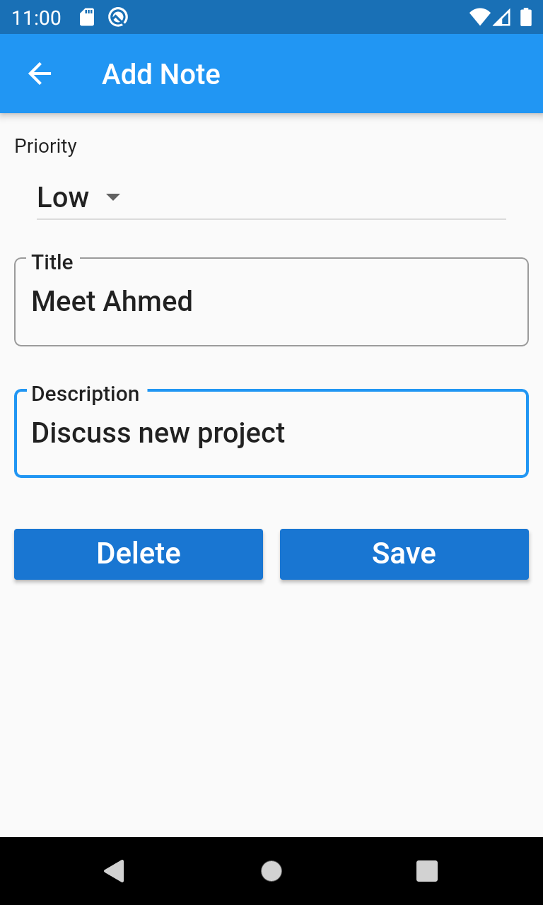

# note_keeper
 
This note keeper demo app is intended for flutter beginners, the app is very simple and written in an easy understandable way, you can learn many things from it.

## ScreenShots 
&nbsp;&nbsp;&nbsp;&nbsp;&nbsp;&nbsp;&nbsp;&nbsp;
&nbsp;&nbsp;&nbsp;&nbsp;&nbsp;&nbsp;&nbsp;&nbsp;

# about the app
* App main language: Dart.
* Framework: Flutter.

## Tools & Libraries
* flutter localizations
* path provider
* redux
* sqflite
* http

## Next Steps
* enable online mode and fetch notes from online server
* add a `When` date field that would fire an alarm when due date comes to remind the user

